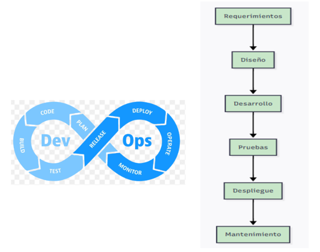

# Actividad 1
* Nombre: Diego Delgado
* Fecha: 3/09/2025
* Tiempo invertido: 
* Entorno: 

#### 4.1 DevOps vs. Cascada tradicional

####  Por qué DevOps acelera y reduce riesgo en software para la nube frente a cascada
- Debido a que se enfoca en el feedback continuo, entregas incrementales y automatización. Esto permite detectar y corregir fallos en la infraestructura de la nube rápidamente, a diferencia de la cascada donde el feedback llega tarde y un error tardío puede ocasionar que se tenga que volver a empezar gran parte del proyecto.
#### Contexto donde cascada aún puede ser factible
Por ejemplo, para sistemas con certificaciones regulatorias estrictas, como dispositivos médicos que son requeridos por la FDA.
Criterios verificables:
*  Documentación Rigurosa: Documentación que demuestre conformidad con estándares como **ISO 13485**. Cada paso debe ser validado y verificado meticulosamente antes de proceder.
* Validación exhaustiva: Antes de ser usado en pacientes se debe tener pruebas de seguridad completadas, porcentaje de requisitos críticos de seguridad validados antes del lanzamiento.

Trade-offs: 
* Se sacrifica la velocidad de entrega de DevOps para garantizar la máxima conformidad regulatoria y seguridad.
* Obtener una alta predictibilidad asegurando que se cumple con todos los requisitos críticos desde el inicio.
