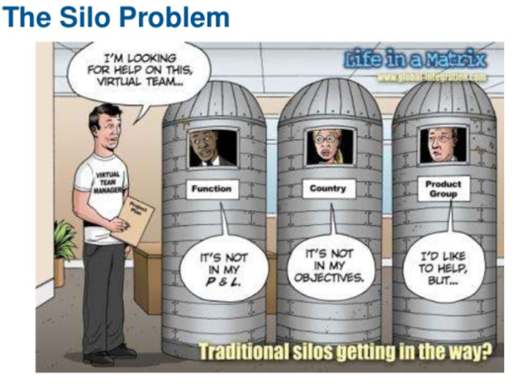
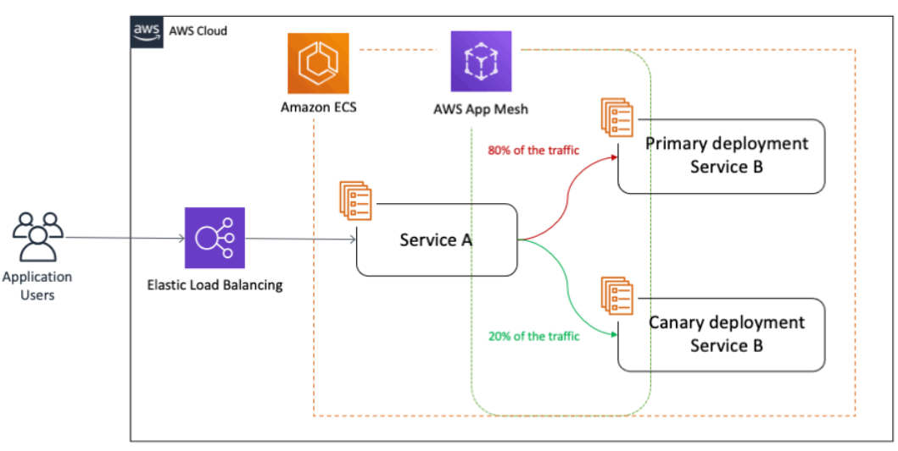

# Actividad 1
* Nombre: Diego Delgado
* Fecha: 3/09/2025
* Tiempo invertido: 
* Entorno: 

#### 4.1 DevOps vs Cascada tradicional

####  Por qué DevOps acelera y reduce riesgo en software para la nube frente a cascada
- Debido a que se enfoca en el feedback continuo, entregas incrementales y automatización. Esto permite detectar y corregir fallos en la infraestructura de la nube rápidamente, a diferencia de la cascada donde el feedback llega tarde y un error tardío puede ocasionar que se tenga que volver a empezar gran parte del proyecto.
#### Contexto donde cascada aún puede ser factible
Por ejemplo, para sistemas con certificaciones regulatorias estrictas, como dispositivos médicos que son requeridos por la FDA.

**Criterios verificables**:
*  **Documentación Rigurosa**: Documentación que demuestre conformidad con estándares como **ISO 13485**. Cada paso debe ser validado y verificado meticulosamente antes de proceder.
* **Validación exhaustiva**: Antes de ser usado en pacientes se debe tener pruebas de seguridad completadas, porcentaje de requisitos críticos de seguridad validados antes del lanzamiento.

**Trade-offs**: 
* Se sacrifica la velocidad de entrega de DevOps para garantizar la máxima conformidad regulatoria y seguridad.
* Obtener una alta predictibilidad asegurando que se cumple con todos los requisitos críticos desde el inicio.

#### 4.2 Ciclo tradicional de dos pasos y silos (limitaciones y anti-patrones)

#### Limitaciones del ciclo "construcción → operación" sin integración continua

* **Grandes lotes de trabajo**: Los equipos de desarrollo acumulan múltiples funcionalidades antes de entregarlas a operaciones, generando entregas masivas que aumentan la complejidad de despliegue y dificultan la identificación rápida de errores específicos. 

* **Colas de defectos acumulados**: Sin retroalimentación continua entre desarrollo y operaciones, los defectos se acumulan hasta las fases finales del ciclo, incrementando el costo de integración tardía y retrasando significativamente la resolución de problemas.

#### Anti-patrones que agravan incidentes

**"Throw over the wall"**: Los desarrolladores completan su código y lo "lanzan por encima del muro" al equipo de operaciones sin colaboración ni conocimiento compartido. Este handoff crea asimetrías de información donde operaciones debe resolver incidentes sin contexto del código, aumentando el MTTR (Mean Time To Recovery) y generando múltiples retrabajos.

**Seguridad como auditoría tardía**: La seguridad se evalúa únicamente al final del ciclo de desarrollo, cuando los cambios arquitecturales son costosos. Esto genera degradaciones repetitivas donde vulnerabilidades detectadas tarde requieren rehacer componentes completos, incrementando el tiempo de resolución y expone al sistema por tiempo prolongado a posibes ataques.

#### 4.3 Principios y beneficios de DevOps (CI/CD, automatización, colaboración; Agile como precursor)

#### Integración Continua (CI) y Despliegue Continuo (CD)

**CI**: Los desarrolladores integran código frecuentemente en pequeños lotes, reduciendo la complejidad de integración y facilitando la identificación de errores específicos. Cada commit desencadena pruebas automatizadas al código, proporcionando feedback inmediato sobre la calidad del cambio.

**CD**: El despliegue continuo automatiza la promoción de código a través de entornos, donde la colaboración DevOps determina qué cambios avanzan y cuáles se bloquean basándose en criterios de calidad y estabilidad predefinidos.

#### Práctica Agile alimenta decisiones del pipeline

**Reuniones diarias**: Fomenta la colaboración continua y así los equipos identifican impedimentos en el pipeline y toman decisiones inmediatas sobre qué PRs requieren atención prioritaria o qué despliegues deben pausarse por dependencias bloqueadas.

#### Indicador observable para medir mejora de colaboración DevOps

**Tiempo desde PR listo hasta despliegue en entorno de pruebas**: Mide la eficiencia de la colaboración al cuantificar el tiempo transcurrido desde que un PR está marcado como "ready for review" hasta su despliegue exitoso en el entorno de testing. Para ello podemos utilizar un tablero kanboard o webhooks en GitHub.

#### 4.4 Evolución a DevSecOps (seguridad desde el inicio: SAST/DAST; cambio cultural)

#### Diferenciación SAST, DAST y ubícalos en el pipeline

**SAST (Static Application Security Testing)**: Análisis estático del código fuente durante la fase de construcción, antes de compilar. Se ubica temprano en el pipeline, inmediatamente después del commit, para detectar vulnerabilidades como inyección SQL, XSS y credenciales hardcodeadas.

**DAST (Dynamic Application Security Testing)**: Pruebas dinámicas sobre la aplicación en ejecución en entornos de staging, simulando ataques reales para identificar vulnerabilidades de configuración, autenticación débil y exposición de datos sensibles.

#### Gate mínimo de seguridad con umbrales cuantitativos

1. **Bloqueo por hallazgos críticos**: Cualquier vulnerabilidad clasificada como crítica en componentes expuestos públicamente bloquea automáticamente la promoción a producción.

2. **Cobertura mínima de pruebas de seguridad**: 85% de cobertura en pruebas de seguridad automatizadas para endpoints críticos y funcionalidades que manejan datos sensibles.

#### ¿cómo evitar el "teatro de seguridad" (cumplir checklist sin reducir riesgo)? Propón dos señales de eficacia y cómo medirlas

**Disminución de hallazgos repetidos**: Verificar que los parches que aplicamos realmente solucionen los problemas, no solo los “tapen” temporalmente y que las mismas vulnerabilidades no vuelvan a aparecer sprint tras sprint para ello podemos calcular el porcentaje de vulnerabilidades recurrentes entre sprints.

**Reducción en tiempo de remediación**: Tiempo promedio desde detección de vulnerabilidad hasta su resolución completa, medido mediante tracking de tickets de seguridad desde creación hasta cierre.

#### 4.5 CI/CD y estrategias de despliegue (sandbox, canary, azul/verde)

#### Estrategia elegida para microservicio de autenticación

Para el servicio de autenticación se puede utilizar canary deployment dirigiendo inicialmente el 5% del tráfico a la nueva versión y aumentando gradualmente hasta 100% basándose en métricas de éxito. Esta estrategia es ideal para servicios críticos como de autenticación porque permite una validación real.

#### Tabla de riesgos vs mitigaciones

| **Riesgo** | **Mitigación** |
|------------|----------------|
| Regresión funcional en autenticación | Validación automatizada de contratos de API y suite de pruebas de integración antes de promover |
| Costo operativo del doble despliegue | Límite de tiempo de convivencia máximo de 2 horas para versiones canary |
| Manejo inconsistente de sesiones activas | Implementación de "graceful draining" y compatibilidad backward de esquemas de tokens JWT |

#### Si el KPI técnico se mantiene, pero cae una métrica de producto (conversión), explica por qué **ambos tipos de métricas** deben coexistir en el gate.
Deben coexistir ya que aunque el KPI técnico se mantenga estable, una caída en la métrica de producto (tasa de conversión de login exitoso) puede indicar problemas de UX, latencia imperceptible para el sistema pero frustrante para usuarios, quienes son los que experimentan el producto completo, no solo la ausencia de errores técnicos.

