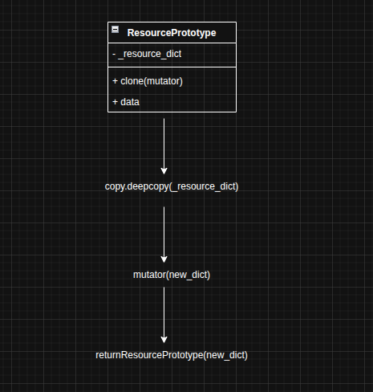

### Actividad: Patrones para módulos de infraestructura

## Fase 1: Exploración y análisis

### 1. Singleton

**¿Cómo garantiza `SingletonMeta` una sola instancia?**

`SingletonMeta` implementa el patrón Singleton a nivel de metaclase usando un diccionario `_instances` que almacena la única instancia de cada clase. En el método `__call__`, primero verifica si la clase ya existe en `_instances`. Si no existe, crea la instancia y la guarda, en caso ya exista, simplemente retorna la instancia almacenada. Esto garantiza que múltiples llamadas a `ConfigSingleton("dev")` retornen el mismo objeto en memoria.

**El rol del loc** es proteger contra condiciones de carrera en entornos multihilo, para evitar por ejemplos que al tener dos hilos cada uno de ellos cree su propia instancia por lo cual `with cls._lock:` asegura que solo un hilo pueda ejecutar el bloque de creación a la vez, manteniendo la unicidad incluso bajo concurrencia.

### 2. Factory

**Encapsulación de creación:**

`NullResourceFactory` encapsula toda la lógica de creación de recursos `null_resource` en un único método estático `create()`. Esto separa la construcción de la estructura JSON de Terraform del código cliente. El método retorna un diccionario con la estructura exacta, siguiendo el formato JSON que Terraform requiere.

**El propósito de sus triggers** es permitir que Terraform detecte si la configuración cambió y necesita aplicar actualizaciones, implementando el concepto de infraestructura inmutable, por ejemplo se esa usando los triggers `factory_uuid` y `timestamp`.

### 3. Prototype

**Diagrama UML del proceso de clonación:**



El `mutator` es una función que recibe el diccionario clonado y lo modifica in-place. Esto permite personalizar cada instancia sin alterar el prototipo original. El mutator renombra recursos de `"placeholder"` a `"placeholder_0"`, `"placeholder_1"`, etc., y añade un trigger `"index"` único.

### 4. Composite

**Agregación de bloques:**

`CompositeModule` implementa el patrón Composite tratando múltiples recursos Terraform como una unidad lógica. El método `add()` acumula diccionarios de recursos en `_children`. El método `export()` itera sobre los hijos y combina todos los bloques bajo una clave `"resource"` unificada. Esto produce un JSON válido para Terraform donde todos los recursos están bajo un solo bloque `"resource"`, permitiendo aplicar `terraform apply` al archivo completo.

### 5. Builder

**Orquestación Factory - Prototype - Composite:**

`InfrastructureBuilder` coordina los tres patrones:

1. **Factory**: Crea un recurso base usando `NullResourceFactory.create("placeholder")`
2. **Prototype**: Envuelve el recurso en `ResourcePrototype` para permitir clonación
3. **Loop + Mutator**: Clona el prototipo N veces, cada vez aplicando un mutator que personaliza el índice
4. **Composite**: Agrega cada clon al módulo compuesto con `self._module.add(clone)`

Finalmente, `export()` serializa el módulo compuesto a JSON con `json.dump()`, generando `terraform/main.tf.json`. Esta orquestación permite generar infraestructura escalable mediante composición de patrones.

## Fase 2: Ejercicios prácticos

### Ejercicio 2.1: Extensión del Singleton

Para implementar el método `reset()` en la clase ConfigSingleton solo necesito limpiar el diccionario settings pero mantener created_at intacto:

```python
def reset(self):
    self.settings.clear()
```

Como el Singleton asegura que solo existe una instancia en memoria, cuando hago `c1.reset()` y luego creo `c2`, ambas variables apuntan al mismo objeto, entonces settings estará vacío en ambas pero created_at sigue siendo el timestamp original.

### Ejercicio 2.2: Variación de la Factory

Creé una subclase que extiende NullResourceFactory y permite pasar un formato personalizado para el timestamp:

```python
class TimestampedNullResourceFactory(NullResourceFactory):
    @staticmethod
    def create(name: str, fmt: str = '%Y%m%d') -> dict:
        ts = datetime.utcnow().strftime(fmt)
        triggers = {"formatted_timestamp": ts}
        return NullResourceFactory.create(name, triggers)
```

Si uso `fmt='%Y%m%d'`, el trigger queda como (solo fecha). Esto hace que Terraform detecte el cambio cada día y puede recrear el recurso automáticamente, útil para recursos que necesitan renovarse periódicamente.

### Ejercicio 2.3: Mutaciones avanzadas con Prototype

Para este ejercicio tuve que crear un mutator más complejo que no solo modifica el recurso existente sino que también añade un recurso nuevo de tipo local_file:

```python
def add_welcome_file(block: dict):
    # Primero modifico el null_resource agregando un trigger
    res = block["resource"][0]["null_resource"][0]
    first_key = next(iter(res.keys()))
    res[first_key][0]["triggers"]["welcome"] = "¡Hola!"

    # Luego añado un nuevo recurso local_file al mismo bloque
    block["resource"].append({
        "local_file": [{
            "welcome_txt": [{
                "content": "Bienvenido",
                "filename": "${path.module}/bienvenida.txt"
            }]
        }]
    })

proto = ResourcePrototype(NullResourceFactory.create("app_0"))
clone = proto.clone(add_welcome_file)
```

Después de hacer `terraform apply` se genera el archivo bienvenida.txt en el directorio del módulo.

### Ejercicio 2.4: Submódulos con Composite

El CompositeModule original solo maneja recursos, pero para soportar submódulos tuve que modificar el método export() para que también agregue bloques "module":

```python
def export(self) -> Dict[str, Any]:
    aggregated = {"module": [], "resource": []}
    for child in self._children:
        aggregated["module"].extend(child.get("module", []))
        aggregated["resource"].extend(child.get("resource", []))
    return aggregated
```

Ahora puedo crear submódulos y agregarlos al composite:

```python
network_module = {"module": [{"network": {"source": "./modules/network"}}]}
app_module = {"module": [{"app": {"source": "./modules/app"}}]}

comp = CompositeModule()
comp.add(network_module)
comp.add(app_module)
```

Después ejecuto `terraform validate` para asegurarme que las referencias entre módulos son correctas.

### Ejercicio 2.5: Builder personalizado

Implementé el método `build_group()` que crea un grupo de recursos y los encapsula en un módulo:

```python
def build_group(self, name: str, size: int) -> "InfrastructureBuilder":
    base = NullResourceFactory.create(name)
    proto = ResourcePrototype(base)
    group_resources = []

    for i in range(size):
        def mut(block, idx=i):
            res = block["resource"][0]["null_resource"][0]
            res[f"{name}_{idx}"] = res.pop(name)
        group_resources.append(proto.clone(mut).data)

    # Empaqueto todos los recursos como un módulo
    module_block = {
        "module": [{
            name: {
                "source": "./modules/group",
                "resources": group_resources
            }
        }]
    }
    self._module.add(module_block)
    return self
```

## Fase 3: Desafíos teórico-prácticos

### 3.1 Comparativa Factory vs Prototype

Cada uno tiene casos de uso específicos en IaC:

**Factory** es mejor cuando se necesita crear recursos completamente diferentes desde cero. Por ejemplo, si tengo que generar diferentes tipos de recursos AWS (RDS, S3, EC2), cada uno con su propia estructura. La factory encapsula toda la lógica de construcción en un solo lugar, entonces si necesito cambiar cómo se crea un recurso, solo modifico el método `create()`.

**Prototype** lo uso cuando tengo un template base que necesito replicar muchas veces con pequeñas modificaciones. El problema es que `deepcopy()` puede ser costoso si el objeto es muy grande (com9 copiar 1000 líneas de JSON 150 veces).

En cuanto a mantenimiento, Factory centraliza todo en un método pero Prototype es más flexible con los mutators, aunque a veces los mutators se vuelven complicados si hay que hacer transformaciones profundas.

En este proyecto veo que se usan ambos: Factory crea el recurso base y Prototype lo clona 15 veces.

### 3.2 Adapter para buckets

Implementé el patrón Adapter para convertir recursos null_resource en buckets simulados:

```python
class MockBucketAdapter:
    def __init__(self, null_block: dict):
        self.null = null_block

    def to_bucket(self) -> dict:
        # Extraigo el nombre del recurso y sus triggers
        res = self.null["resource"][0]["null_resource"][0]
        name = next(iter(res.keys()))
        triggers = res[name][0]["triggers"]

        # Lo convierto a formato bucket
        return {
            "resource": [{
                "mock_cloud_bucket": [{
                    name: [{
                        "bucket_name": name,
                        "tags": triggers
                    }]
                }]
            }]
        }
```

Para usarlo con el Builder:

```python
builder = InfrastructureBuilder("prod")
null_res = NullResourceFactory.create("data_bucket")
bucket = MockBucketAdapter(null_res).to_bucket()
builder._module.add(bucket)
```

La ventaja es que puedo migrar recursos null_resource a recursos cloud reales sin cambiar todo el código que ya tengo.

### 3.3 Tests automatizados con pytest

Escribí tests para verificar que los patrones funcionan correctamente:

```python
def test_singleton_meta():
    # Verifico que siempre retorna la misma instancia
    a = ConfigSingleton("X")
    b = ConfigSingleton("Y")
    assert a is b, "Debería ser la misma instancia"
    assert a.env_name == "X", "env_name no cambia después de la primera inicialización"

def test_prototype_clone_independent():
    # Los clones deben ser independientes entre sí
    proto = ResourcePrototype(NullResourceFactory.create("app"))
    c1 = proto.clone(lambda b: b.update({"field1": 1}))
    c2 = proto.clone(lambda b: b.update({"field2": 2}))

    assert "field1" not in c2.data
    assert "field2" not in c1.data
    assert "field1" in c1.data
    assert "field2" in c2.data

def test_factory_triggers():
    # La factory debe generar triggers automáticos
    res = NullResourceFactory.create("test")
    triggers = res["resource"][0]["null_resource"][0]["test"][0]["triggers"]
    assert "factory_uuid" in triggers
    assert "timestamp" in triggers
```

Ejecuto con: `pytest test_patterns.py -v`

### 3.4 Escalabilidad de JSON

Para medir el tamaño del archivo JSON generado hice este script:

```python
import os

builder15 = InfrastructureBuilder("test")
builder15.build_null_fleet(15).export("terraform/test15.tf.json")

builder150 = InfrastructureBuilder("test")
builder150.build_null_fleet(150).export("terraform/test150.tf.json")

size15 = os.path.getsize("terraform/test15.tf.json") / 1024  # KB
size150 = os.path.getsize("terraform/test150.tf.json") / 1024

print(f"15 recursos: {size15:.2f} KB")
print(f"150 recursos: {size150:.2f} KB")
```

Los resultados muestran que crece linealmente.

**Problemas en CI/CD:**

Cuando los archivos JSON se vuelven muy grandes, empiezan a aparecer problemas:
- `terraform plan` se vuelve muy lento
- Los diffs en Git consumen mucha memoria
- El parsing de JSON en los pipelines puede dar timeout

**Soluciones que propongo:**

1. Dividir por componentes: tener archivos separados como `network.tf.json`, `compute.tf.json`, `storage.tf.json` en lugar de un solo archivo gigante
2. Usar workspaces de Terraform para separar dev, staging y prod en archivos diferentes
3. Generar dinámicamente solo los módulos que necesito para cada deploy, no regenerar todo cada vez