## Parte 1: Construir - Makefile y Bash desde cero

1.
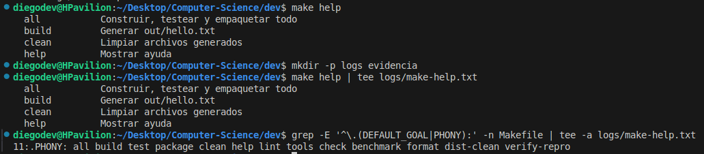

`make help` busca en el Makefile todas las líneas con formato
`target: ## descripción` y las muestra como lista de comandos 
disponibles. Usa grep y awk para extraer y formatear esta info.

`.DEFAULT_GOAL := help` hace que al ejecutar solo `make` (sin 
argumentos) se corra automáticamente el target `help`.

`.PHONY` declara targets que no son archivos reales sino comandos. 
Si hubiera un archivo llamado "clean", Make pensaría que ya está 
actualizado y no lo ejecutaría, pero con PHONY, Make siempre ejecuta 
estos targets sin importar si existe un archivo con ese nombre.

2.
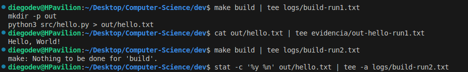

La primera ejecución de `make build` crea `out/hello.txt` ejecutando el
script Python. La segunda muestra `make: Nothing to be done for 'build'`
porque Make compara timestamps y ve que `src/hello.py` no cambió después
de crear el output.

Make usa un grafo de dependencias: si el archivo fuente es más reciente
que el target, recompila. Si no, no hace nada.

3.
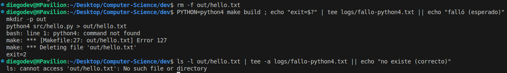

Al usar `PYTHON=python4` (comando inexistente), Make intenta ejecutar la
receta pero falla con "command not found". El modo estricto `-e` del shell
detiene la ejecución inmediatamente al detectar el error.

Luego `.DELETE_ON_ERROR` hace que Make elimine automáticamente
`out/hello.txt` si la receta falla, evitando dejar archivos parciales o
corruptos. El `ls` confirma que el archivo no existe, manteniendo el
sistema en estado consistente.

4.
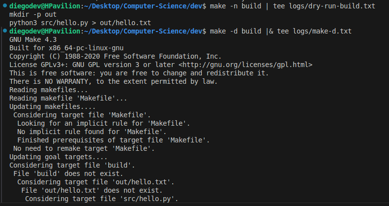

`make -n build` muestra qué comandos se ejecutarían sin hacerlo realmente
(dry-run). Útil para verificar qué hará Make antes de ejecutarlo.

`make -d build` muestra el proceso de decisión completo: Make revisa si
`build` existe, luego verifica `out/hello.txt` (no existe),
después `src/hello.py` (existe, no necesita remake) y concluye que se debe
crear `out/hello.txt` porque no existe y su prerequisito está disponible.

5.
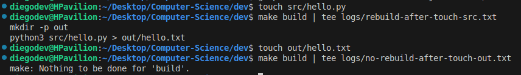

`touch src/hello.py` actualiza el timestamp del archivo fuente, haciéndolo
más reciente que `out/hello.txt`. Make detecta esto y recompila porque el
prerequisito es más nuevo que el target.

`touch out/hello.txt` actualiza el timestamp del target, haciéndolo más
reciente que la fuente. Make ve que el target ya está actualizado respecto
a sus prerequisitos y no hace nada. La incrementalidad funciona comparando
timestamps: solo recompila cuando la fuente cambió después del output.

6.
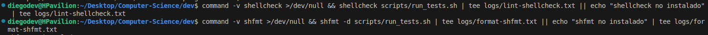

`shellcheck` analiza scripts Bash en busca de errores comunes (variables sin
comillas, etc.). En este caso no reportó problemas.

`shfmt` formatea scripts Bash siguiendo estándares de estilo. En mi caso no lo tengo no
instalado en este entorno.

7.
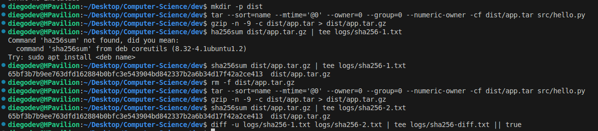

Hash obtenido: `65bf3b7b9ee763dfd162884b0bfc3e543904bd842337b2a6b34d17f42a2ce413`

Los dos empaquetados producen exactamente el mismo hash SHA256, demostrando
reproducibilidad perfecta. Los flags de tar eliminan variabilidad:

- `--sort=name`: ordena archivos alfabéticamente
- `--mtime='@0'`: fija timestamp a epoch (1970-01-01)
- `--owner=0 --group=0 --numeric-owner`: normaliza permisos
- `gzip -n`: no incluye timestamp en el archivo comprimido

Esto garantiza builds deterministas: mismo código = mismo binario, útil para
CI/CD y auditorías de seguridad.

8.
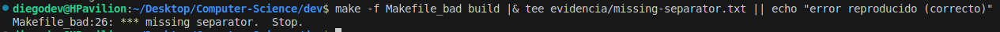

Make requiere que los comandos a ejecutar comiencen con
un TAB literal, no con espacios. Al reemplazar el TAB por espacios en
`Makefile_bad`, Make no reconoce la línea como comando y muestra:
`missing separator. Stop.`

## Parte 2: Leer - Analizar un repositorio completo

1.
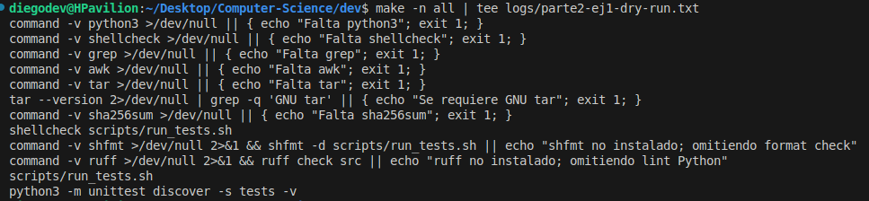

`make -n all` muestra los comandos sin ejecutarlos. El target `all` tiene
dependencias en cadena: `tools -- lint -- build -- test -- package`.

Se ve que primero verifica herramientas (python3, shellcheck, tar, etc),
luego ejecuta lint con shellcheck, después construiría el target `build`
(que crea `out/hello.txt`), ejecutaría tests con `scripts/run_tests.sh` y
`unittest`, y finalmente crearía el paquete `dist/app.tar.gz`. Make respeta
el orden de dependencias declarado en el Makefile.

2.
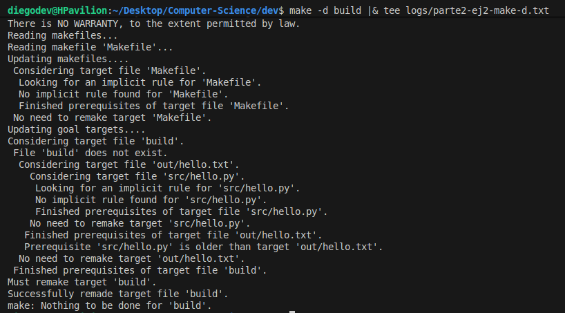

`make -d build`. Primero considera `build` (no existe, es PHONY), luego verifica su dependencia `out/hello.txt`, que depende de `src/hello.py`.

En la salida podemos identificar que "Prerequisite 'src/hello.py' is older than target 'out/hello.txt'". Como el archivo fuente es más antiguo que el output, Make concluye "No need to remake target 'out/hello.txt'".

3.
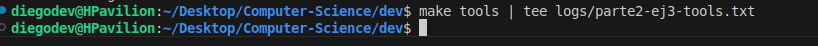

`make tools` verifica que todas las dependencias críticas estén instaladas y notamos que todo pasó correctamente.
